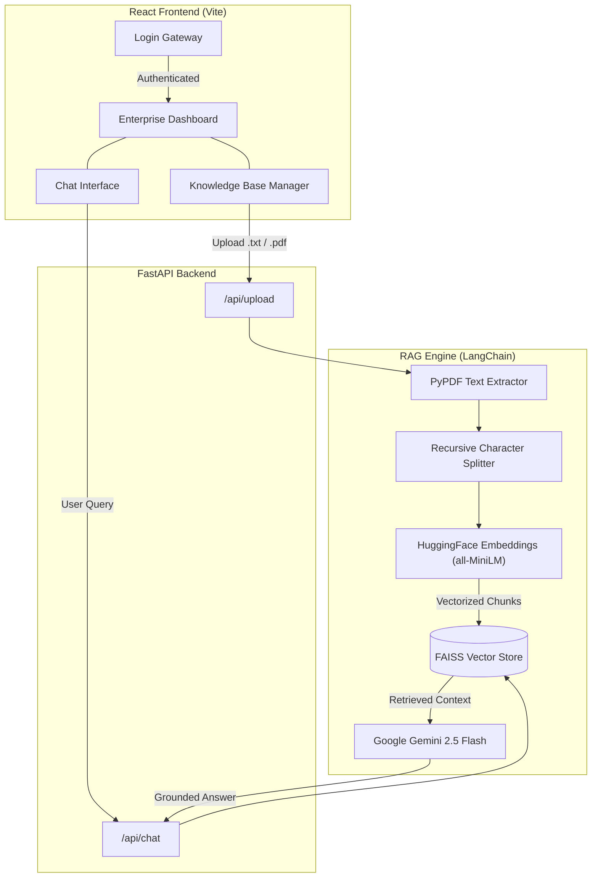

# 🚀 OmniRAG Enterprise

<div align="center">
  
  
  
  
  
  
</div>

<br />

OmniRAG Enterprise is a highly scalable, production-ready **Retrieval-Augmented Generation (RAG)** application. It features a stunning glassmorphism dashboard built with React and Vite, powered by an async FastAPI backend utilizing Google's state-of-the-art **Gemini 2.5 Flash** model and local HuggingFace embeddings via FAISS.

## ✨ Key Features

*   **🔒 Secure Access Gateway**: Full authentication routing with a simulated login environment for portfolio presentation.
*   **📄 Intelligent PDF Ingestion**: Drag-and-drop `.pdf` and `.txt` files to instantly chunk, embed, and store knowledge locally in a FAISS vector database using `pypdf`.
*   **🧠 Omni-Knowledge Engine**: Answers general questions using Gemini 2.5 Flash, but seamlessly augments its responses with your proprietary data when queried about uploaded documents.
*   **🎨 Premium Glassmorphism UI**: Beautiful, fully responsive React frontend with fluid micro-animations and a unified design system.

---


## 🏗️ System Architecture



---

## 🚀 Quickstart Guide

### 1. Backend Setup

```bash
# Navigate to backend
cd backend

# Create and activate virtual environment (macOS/Linux)
python -m venv venv
source venv/bin/activate

# Install dependencies
pip install -r requirements.txt

# Configure Environment Variables
# Create a .env file in the backend directory and add your Google API key:
echo "GOOGLE_API_KEY=your_key_here" > .env

# Run the FastAPI server (Port 8001)
python -m uvicorn main:app --port 8001 --reload
```

### 2. Frontend Setup

```bash
# Navigate to frontend
cd frontend

# Install dependencies
npm install

# Start the Vite development server
npm run dev
```

### 3. Usage

1.  Navigate to `http://localhost:5176` in your browser.
2.  Use **any** email and password to pass the simulated login gateway.
3.  Drag and drop a PDF into the Knowledge Base Manager on the left.
4.  Start chatting with your data!
